## 一. 项目背景

#### 1.背景简介

本项目作为区块链服务网络BSN第二次开发者大赛获奖作品，通过区块链智能合约实现物联互通、确权声明、通证激励、社交元宇宙等多元价值融合重载。

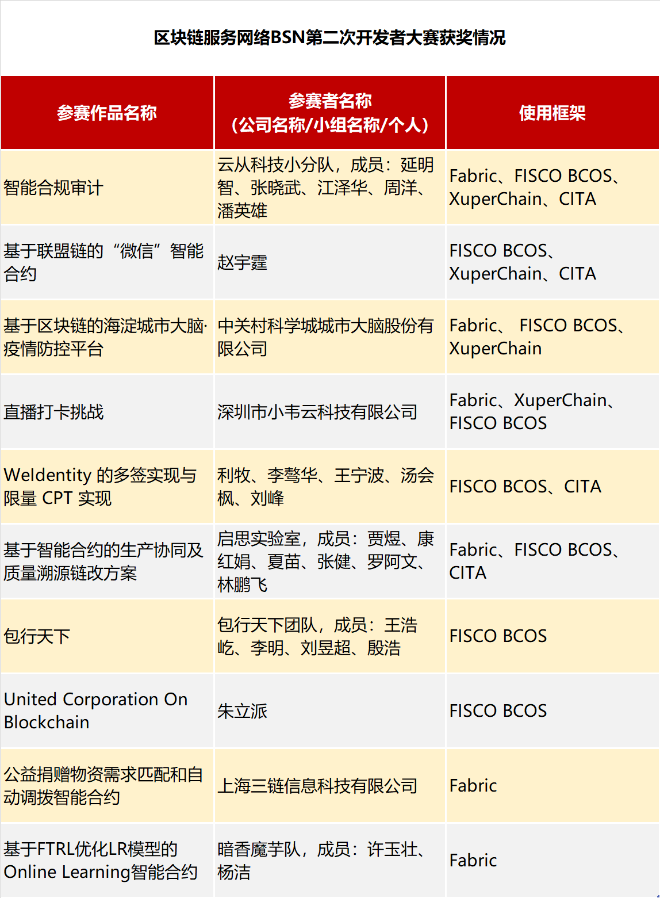

详情可见：http://kb.bsnbase.com/webdoc/view/Pub2c908ad371c6396b01730e85bff12793.html

#### 2.设计理念

2019年，著名的奢侈品品牌路易威登宣布了建设一个区块链溯源防伪平台的计划，不仅仅用于路易威登自有品牌商品的溯源防伪，也希望用于其他奢侈品。2019年底，国际名牌耐克在美国获得了数字运动鞋的专利，不仅采用NFT代币达到溯源防伪的效果，还把数字运动鞋设计成为一种虚拟宠物，可以配对下崽……

随着数字孪生与区块链的蓬勃发展，名牌品牌方越来越关注区块链在奢侈品、时尚名牌商品领域的应用。但是，截止目前，除了溯源防伪和类似耐克提出的这种虚拟宠物的玩法，这些来自传统产业的品牌方并没有找到运用区块链为品牌赋能的正确姿势。

本参赛方案，革命性地提出“**分布式创造品牌价值、去中心化共建品牌生态**”的理念。

首先，“分布式创造品牌价值”：以往这些国际大牌都是通过聘请明星代言来自上而下地塑造品牌文化；而互联网时代带来了UGC用户产生内容的新模式，那么，路易威登、爱马仕等拥有百年历史的国际大牌该如何与时俱进、该如何在追求品牌年轻化的同时又保持顶级品牌的高逼格？本方案提出了一种可能性：植入奢侈品NFC芯片，可以实现与智能终端的绑定，进而通过智能终端的定位模块（GPS、WIFI定位、基站定位等）来给奢侈品完成溯源防伪和“网红目的地打卡”功能，并且把打卡数据记录在区块链上，同时调用智能合约实现通证激励。
这一解决方案可以赋予奢侈品“生命轨迹”，可以让名牌包包（或者名牌服饰）的主人像玩宠物养成游戏一样带着包包去自己喜欢的目的地打卡，用区块链可信数据为自己的包包书写个性化的品牌故事（旅游达人、美食家、购物狂、博物馆爱好者等等,并且区块链账户不需要实名注册，可以保护用户隐私），不仅对于品牌方是一种自下而上的用户画像的信息反馈，而且对于包包主人也是一个进行二次创造个性化品牌附加值的机会，让这个有生命故事的包包真正成为某种生活方式的载体，有利于自己包包在二手交易市场的值增值。

其次，“去中心化共建品牌生态”：本方案还提出了以下设计—允许异业合作的商家悬赏发布打卡目的地，吸引奢侈品包包的主人们来网红咖啡馆、美食餐厅、音乐会或者电影节现场……而走过路过的吃瓜群众也有机会参与进来—
例如，当我在网红咖啡馆看到不远处的美女带着一款令我惊艳的包包的时候，我只要进入微信搜索“包行天下”小程序，就可以搜寻附近的奢侈品包包，了解这个包包的产品信息，也可以为眼前这个包包点赞。以上业务描述体现了本方案意在建构一个去中心化的品牌生态，喜爱名牌商品的爱好者、拥有名牌商品的买家秀，每个人都可以在这个区块链上展现自我、点赞点评；而各行各业的商家，可以不必被中心化的平台剥削收取服务费，可以直接在区块链上通过智能合约发布打卡目的地、并设定自己愿意给打卡者（引流对象）支付的TOKEN奖励。对于品牌方而言，表面上似乎丧失了自主选择异业合作伙伴的控制权，但是换个角度想—如果自己品牌的包包，无论走到哪里，都可以打卡获得代币奖励，相当于自己的包包成为一种VIP身份的象征，不需要品牌方派市场营销人员去洽谈异业合作，就可以吸引各行各业的实体商家参与建设这个共赢的生态。如果是联盟链，可以限制那些不诚信的、与奢侈品牌调性不相符的商家参与；如果是公链，即便不对商家资质进行限制，用户本人也会根据自己的价值观做出选择—我们不难想象:一个背着价值数万元名包的时尚丽人，不会为了价值几十元甚至上百元的TOKEN而去一个与她身份不符的场合打卡的。另外，随着方案的完善，也可以把现有的给包包点赞的功能迁移到给打卡目的地的点赞点评，以便利用市场机制优胜劣汰，让那些能够提供高品质服务或产品的商家可以吸引到更多的精准流量。

## 二．智能合约开发

#### 1. 项目文件简介

智能合约工程目录如下，全部合约通过solidity ^0.4.25版本编译测试：

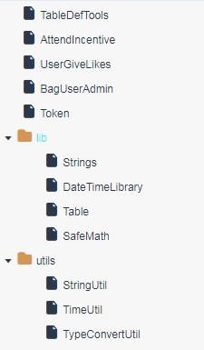

主目录中：

Token是通证智能合约，类ERC20

AttendIncentive是完成包包地点出席、打卡功能的智能合约

UserGiveLikes是用户向周围包包点赞功能的合约

BagUserAdmin是管理包包信息及用户信息的合约

TableDefTools是使用到的分布式存储下表结构、常数定义及CURD工具

子目录utils：

StringUtil是字符串工具合约

TimeUtil是时间处理工具合约

TypeConvertUtil是类型转换工具合约

子目录lib:

Strings是字符串处理工具库

DateTimeLibrary是时间处理工具库

Table是BCOS链预编译表工具库

SafeMath是安全的基本数学计算库

#### 2. 合约文件结构介绍

合约文件结构如下图所示，lib文件夹中合约是项目中合约所用到的库，被utils中合约以及TableDefTools合约所使用。utils文件中的合约和TableDefTools合约作为二次封装的工具合约。utils中的合约被核心合约（UserGiveLikes，BagUserAdmin，TableDefTools的）和TableDefTools所使用。TableDefTools分别被核心合约所继承，方便核心合约访问个表结构、常量的定义以及表操作工具的使用。Token合约全局只有一个，被需要使用Token的合约所引用（使用Token合约的地址引用）。Token合约被调用时调用者是合约地址，因此进行权限控制，将需要使用Token的合约地址加入授权者列表。

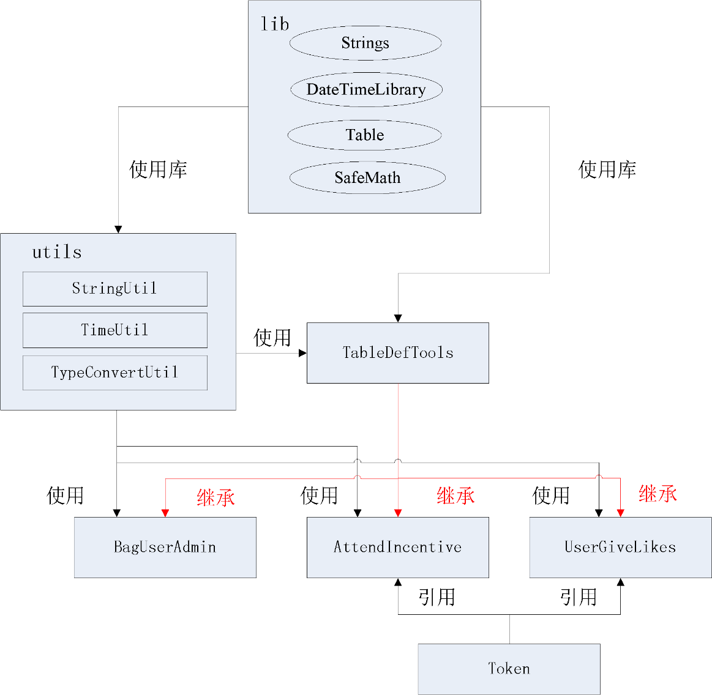

#### 3. 核心合约介绍

用户调用的主要合约是BagUserAdmin、AttendIncentive、UserGiveLikes这三个合约，其他都可统称为工具合约。下面介绍这个三个合约中的方法，其中主要方法用红色标识。

**（1) BagUserAdmin合约**

BagUserAdmin实现包包及用户的链上信息管理，以Table的形式进行存储。当用户拿到包包后可进行查看，看包包是否处于激活状态，若未激活，则可以进行激活。包包激活实际上是在合约包包信息表中插入一条记录，描述该包包的详细情况。包包处于激活状态才会有记录信息，因此，激活后方可使用打卡（AttendIncentive）以及点赞（UserGiveLikes）功能合约。

| **方法**         | **功能**                 | **输入参数** | **输出结果**                   |
| ---------------- | ------------------------ | ------------ | ------------------------------ |
| activateBag      | 激活包包，使其记录在链上 | 包包id       | 执行状态码                     |
|                  |                          | 包包各项参数 | 执行状态码                     |
| isBagActivated   | 查看包包是否激活         | 包包id       | 激活状态，1为已激活，0为未激活 |
| getBagRecordJson | 查询包包全部信息         | 包包id       | 包包信息                       |

涉及到的表：包包信息表（t_bag）。详情如下：

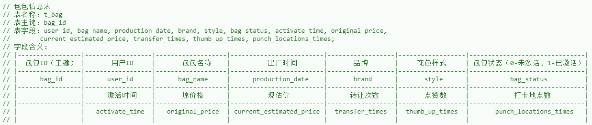

**(2) AttendIncentive合约**

AttendIncentive合约实现用户出席某地或打卡时进行记录并给予Token激励。当服务对用户地理位置信息进行计算后，确认是在规定的活动有效时间以及地点进行打卡，地点属于官方规定的“网红”打卡地，则将对应的地点的ID，以及与之匹配的位置信息传入合约进行存证，然后根据链上位置信息表给出的Token数量进行奖励。规定在一天之内只能进行一次打卡并获得奖励。

| **方法**        | **功能**                                        | **输入参数**                             | **输出结果** |
| --------------- | ----------------------------------------------- | ---------------------------------------- | ------------ |
| dailyAttendance | 用户打卡功能入口，实现打卡信息上链及Token激励。 | 包包id                                   | 执行状态码   |
|                 |                                                 | 打卡详细信息，如判断的地点ID，经纬度等。 | 执行状态码   |
| idataInit       | 预先存入打卡地点数据                            | 无                                       | 无           |

涉及到的表：用户打卡信息表（t_attend_location），打卡地点信息表（t_locations）。详情如下：

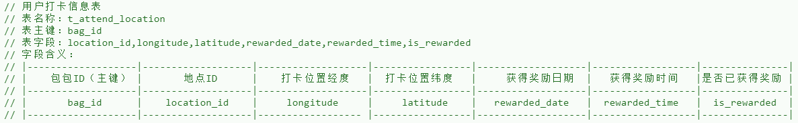

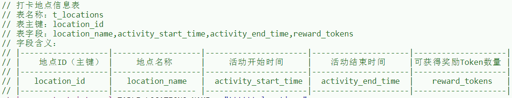

**(3) UserGiveLikes合约**

UserGiveLikes合约实现包包用户互相点赞的我功能，并对点赞双方进行通证激励。对于每个用户，每日会赠送5个点赞，每次为包包点赞会消耗一个，消耗完5个点赞，系统则会奖励给该用户1个token奖励。
对于每个包包，每获得5次点赞，则给该包包对应的用户奖励1个token。

| **方法**        | **功能**               | **输入参数**       | **输出结果** |
| --------------- | ---------------------- | ------------------ | ------------ |
| giveALikeToBag  | 用户对某个包包进行点赞 | 该用户外部账户地址 | 执行状态码   |
|                 |                        | 被点赞的包包id     | 执行状态码   |
| viewBagRecordOf | 查看某个包包信息       | 待查询的包包id     | 包包信息     |

涉及到的表：同合约（1）中包包信息表（t_bag），详情如下：

## 二．智能合约部署过程

为方便合约编写及过程展示，以下步骤通过weBASE平台进行编译、部署及交易执行。

#### 1.编译部署Token合约

如使用testUser用户，如图所示：

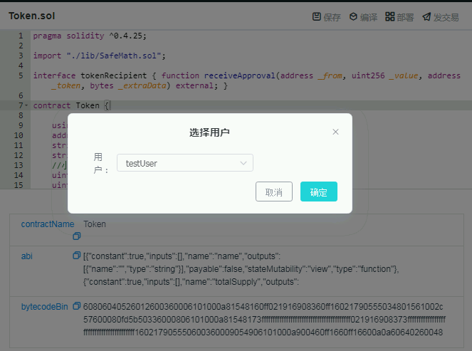

合约部署成功。

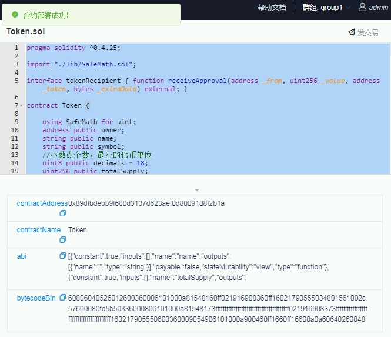

记下合约地址0x89dfbdebb9f680d3137d623aef0d80091d8f2b1a

#### 2.部署BagUserAdmin合约

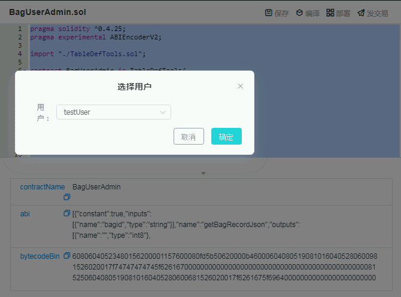

#### 3.部署AttendIncentive合约

该合约部署需要第1步中Token地址合约

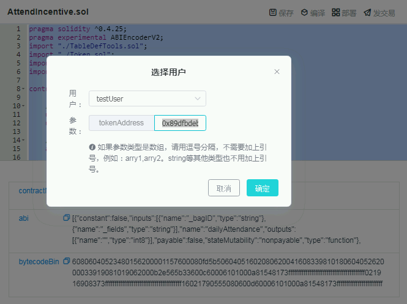

成功部署

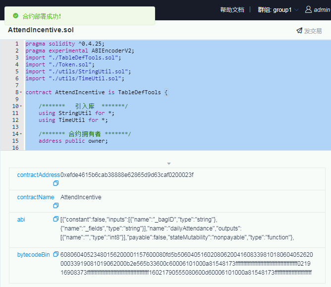

#### 4.编译部署UserGiveLikes合约

该合约部署也需要第1步中Token地址合约

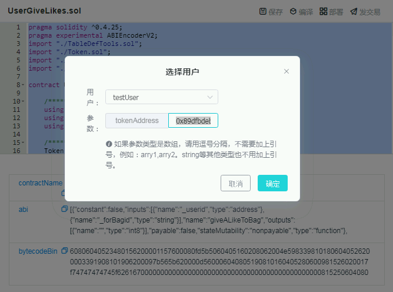

点击确定，部署成功

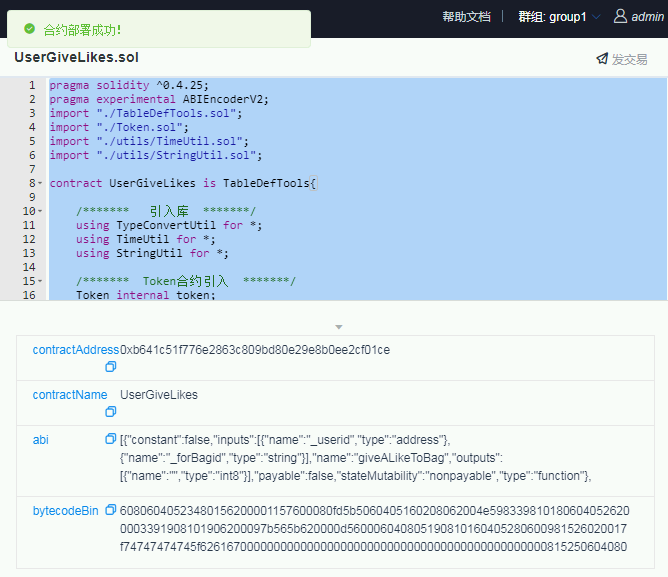

#### 5.设置Token中授权合约账户

调用Token中的setAuthorizedCaller方法，并分别将第3步中AttendIncentive合约和第4步中UserGiveLikes合约的地址作为参数。

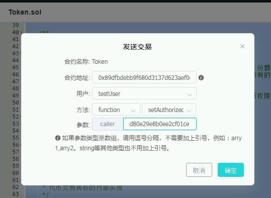

## 三. 智能合约主要功能测试

#### 1.使用BagUserAdmin合约中的activateBag方法激活包包

第一个参数填入："BG00001"

第二个参数填入："0x5fc079ca547f579a85b752dce623333e363fadfe,jipinbao,1998-03-13,LV,oldschool,1,2020-05-28,20000,35000"

说明：红色0x5fc079ca547f579a85b752dce623333e363fadfe为包包所有者的用户地址/id，可以查询他的Token数量。

如图所示：

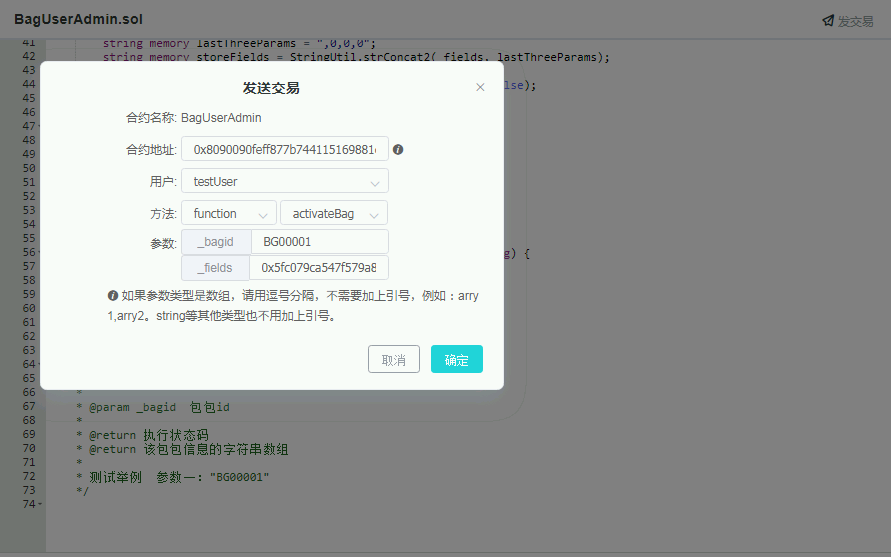

点击交易显示成功，这样就创建了一条包包记录。

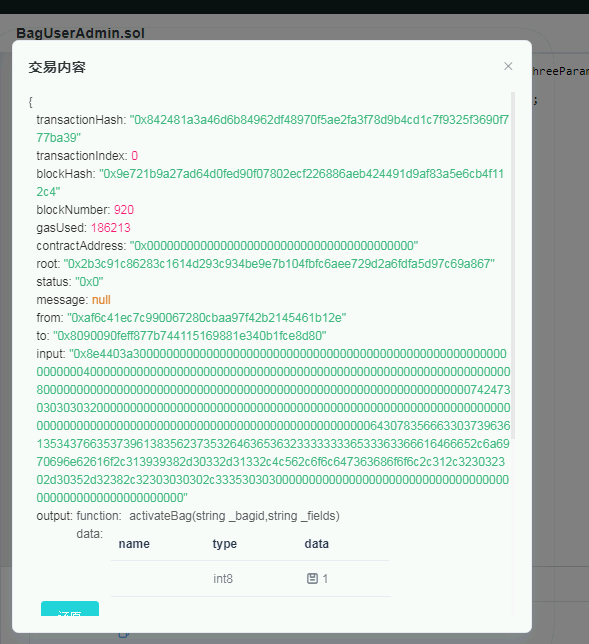

该行为即是向t_bag表中插入记录。

#### 2.查看包包是否激活

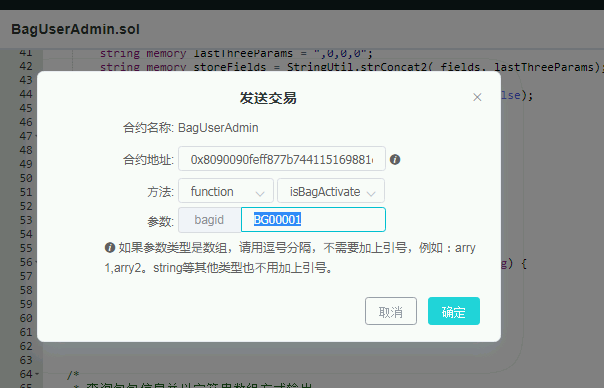

1表示以激活，0表示未激活。返回1表明已激活。

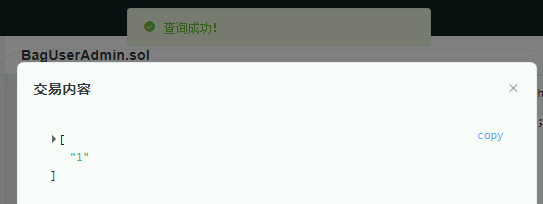

#### 3.UserGiveLikes合约中操作

使用giveALikeToBag方法测试给附近包包点赞功能

如点赞用户id为0x3325323c547f579a85b752dce623333e363fadfe

被点赞的包包id为BG00001，被点赞包包的用户id为0x3325323c547f579a85b752dce623333e363fadfe

每个用户每天有5次点赞机会，消耗完则获得对应1个Token奖励。

每个被点赞的包包，被点赞5次，其主人就获得1个Token奖励。

可使用viewBagRecordOf方法随时查看该包包信息，其中thumb_up_times字段是“已被点赞数”：

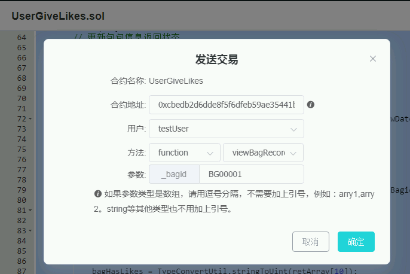

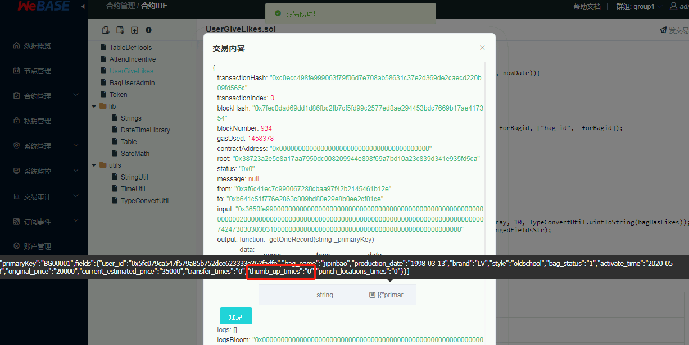

可看到被点赞数为0

然后开始点赞：

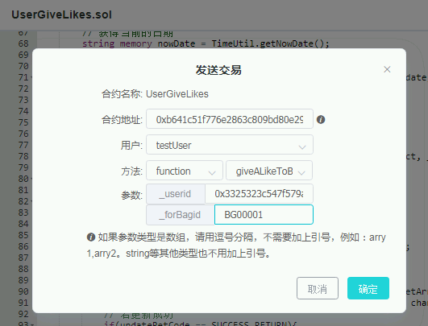

返回1表示调用成功：

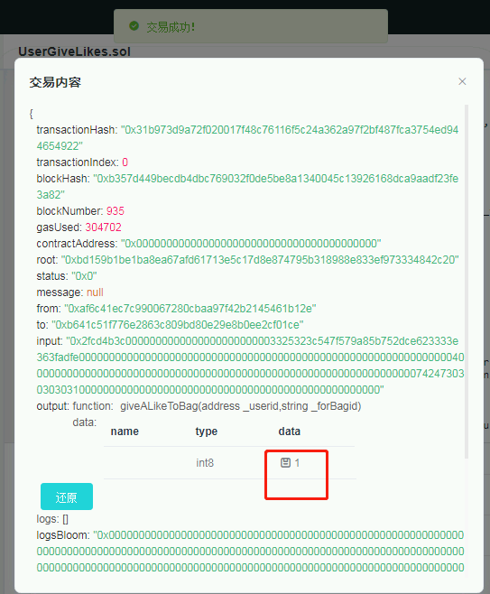

当这样操作5次之后，点赞数变为5：

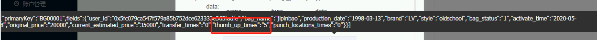

此时查看Token合约中，点赞方和被点赞方的Token：

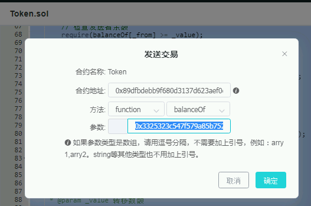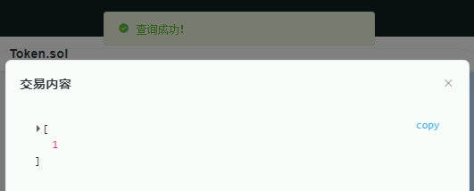

发现点赞方已成功获得一个Token（消耗完当天的5个点赞，获得一个Token）

被点赞包包的主人也获得1个token（因为每获得5个赞，得到1个Token）

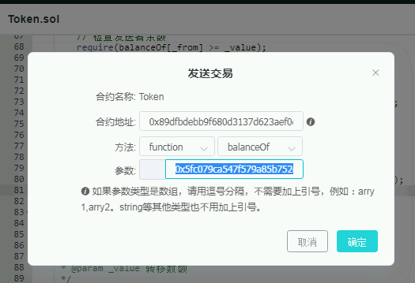

#### 4.AttendIncentive合约打卡获得Token激励的测试

在进行测试之前，第一，要确保AttendIncentive合约部署时使用了Token合约的地址；第二，要确保Token合约调用了setAuthorizedCaller方法，并传入了AttendIncentive合约地址。

每天只能进行一次打卡并获得对应奖励Token。

测试开始，先初始化数据，运行dataInit方法，将比如嘎纳电影节、海天盛筵等地点数据进行预先上链。

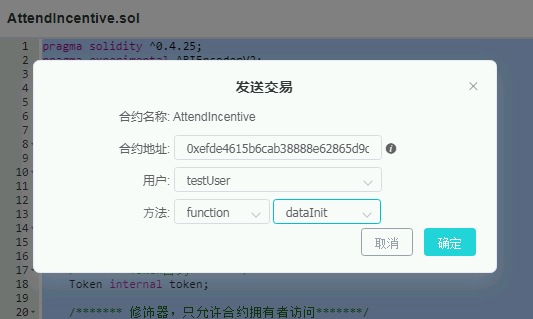

数据上链成功

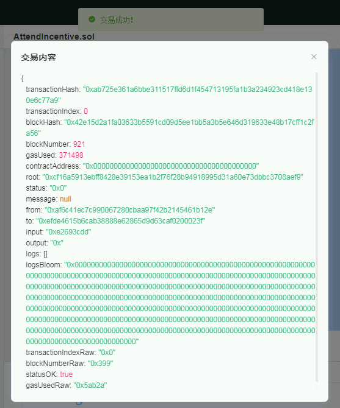

然后运行该合约的dailyAttendance方法进行打卡测试

参数一：BG00001（包包ID）

参数二：001,116.397128,39.916527（地点ID+地点经度纬度）

说明：这个地点ID由服务端进行位置计算得到，不在区块链上进行。

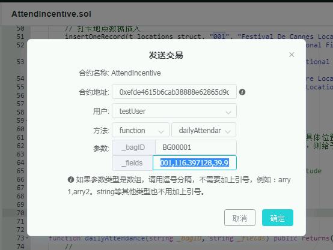

返回成功。

查看调用该合约的testUser公钥地址：

查使用Token合约查看该地址的余额：

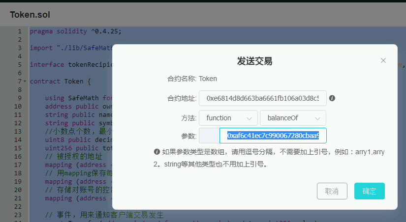

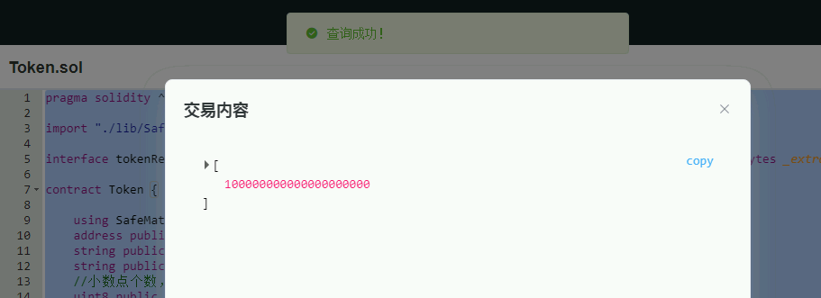

发现余额增加。

测试结束。
